# Libtracer
### Система администрирования библиотеки

Приложение делится на две основные части - пользовательскую (поиск книги) и администраторскую. Администратор в приложении может выполнять выдачу и приём книги, при этом статус доступности книги в бд меняется, а при выдаче в бд добавляется запись о том, кто какую книгу взял и на какой срок. Также администратор может регистрировать новых администраторов/читателей, новые книги и новые полки в библиотеке. При необходимости можно посмотреть список должников библиотеки и список книг, которые в данный момент находятся на руках у читателей.

### Адрес репозитория:
https://github.com/NickWatsonMan/Libtracer
### Члены команды:
Володарский Никита - работа с БД. (Backend developer)
Хлюстова Нелли - работа с UI. (Frontend developer)

### Основные классы:
В папке Model хранятся основные классы:
Book, Person, Person Book, Shelf. Эти классы описывают сущности, представленные в базе данных. Совместно с технологией Entity Framework.
Также есть отдельный класс Context. В этом классе сетятся данные через DbSet. И ниже приведена основная логика проекта. Это все запросы взаимодействия с базой данных. База данных локальна. Для начала работы необходимо сделать update-database к проекту Logics в консоле менеджера пакетов. Таки образом создастся локальная база данных и заполниться первичными данными из метода Seed.  

Метод GetLentBooks() – возвращает лист книг, которые были выданы на руки людям. 

Метод GetDebtors() – возвращает список людей, которые взяли книгу и не вернули вовремя. 

Метод GetBook() – возвращает список книг, доступных в библиотеке, по автору или названию

Метод AddNewUser() – регистрация читателя или библиотекаря

Метод AddBookToLibrary() – регистрация новой книги в библиотеке 

Метод AddNewShelf() – регистрация новой полки в библиотеке. 

Метод HandOutBook() – выдать книгу читателю (срок сдачи книги – это дата выдачи + 30 дней)

Метод HandInBook() – принять книгу у читателя обратно в библиотеку

Метод Auth() – авторизация библиотекаря в системе администрирования библиотеки

Важная информация! (логин ; пароль) первого админа = (1; password)

### Классы окон:
MainWindow – основное меню приложения
SearchWindow – окно, отвечающее за вывод информации о поиске книг
LoginWindow – окно авторизации администратора
OptionsWindow – меню с опциями, доступными администратору
HandOutBook / HandInBook – окна, отвечающие за выдачу / приём книги
RegistrateWindow – окно, в котором администратор может зарегистрировать новых пользователей (администраторов, читателей) / новые книги / новые полки
ListsWindow – в этом окне администратор может посмотреть список должников (читателей, просрочивших срок сдачи книг) / список книг, которые сейчас на руках

Важная информация! В окнах опций админа (HandOutBook / HandInBook / RegistrateWindow / ListsWindow) в правом верхнем углу есть кнопка возврата к OptionsWindow.
### Скриншоты программы:
//Начальное окно
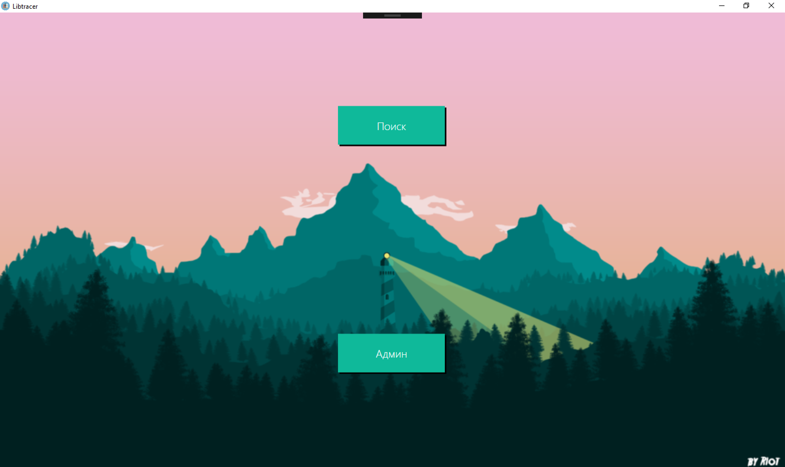
//Окно поиска 
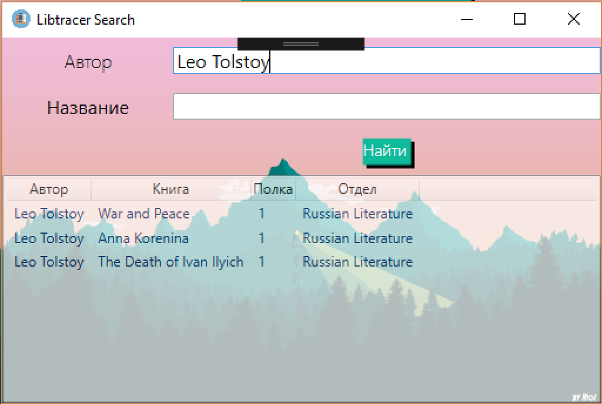
//Окно авторизации админа
 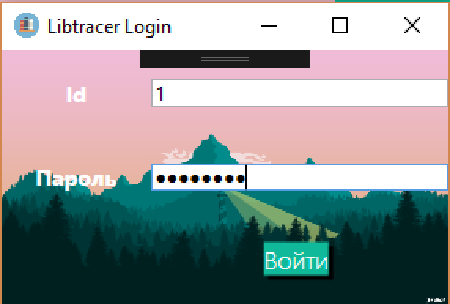
//Админ панель
 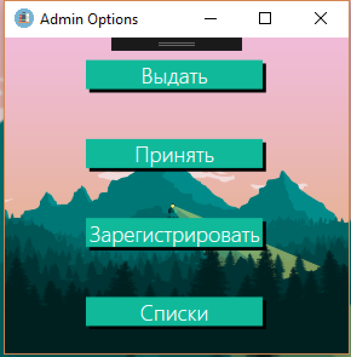
//Окно выдачи книги 
 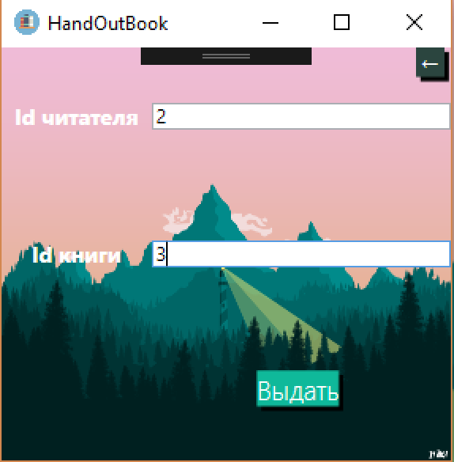
//Окно приема книги
 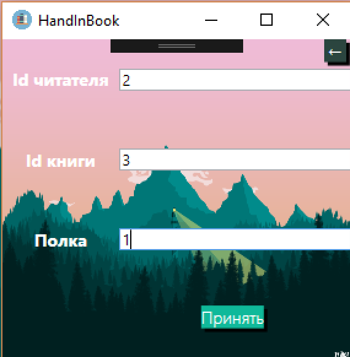
//Окно регистрации (регистрируем читателя)
 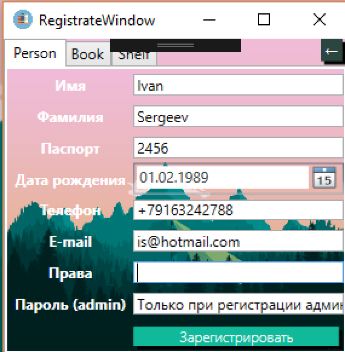
//Окно регистрации (регистрируем админа)
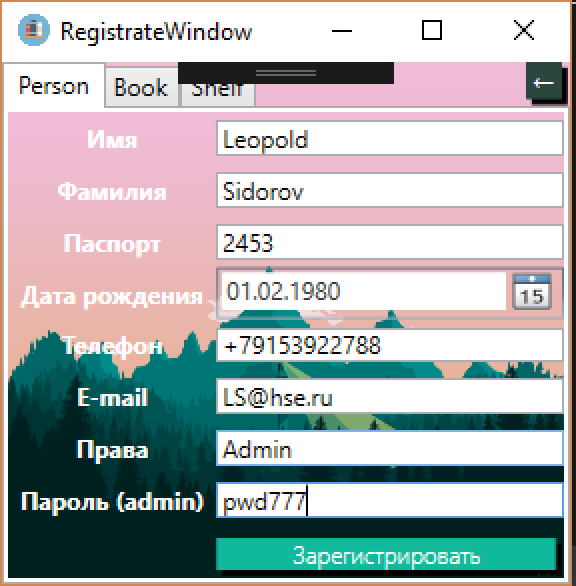
//Регистрируем книгу
 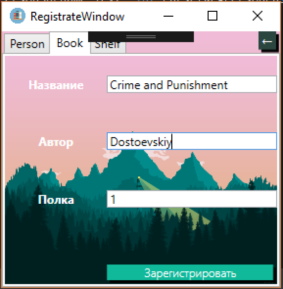
//Регистрируем полку
 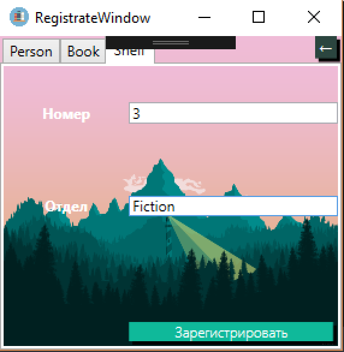
//Окно со списком должников 
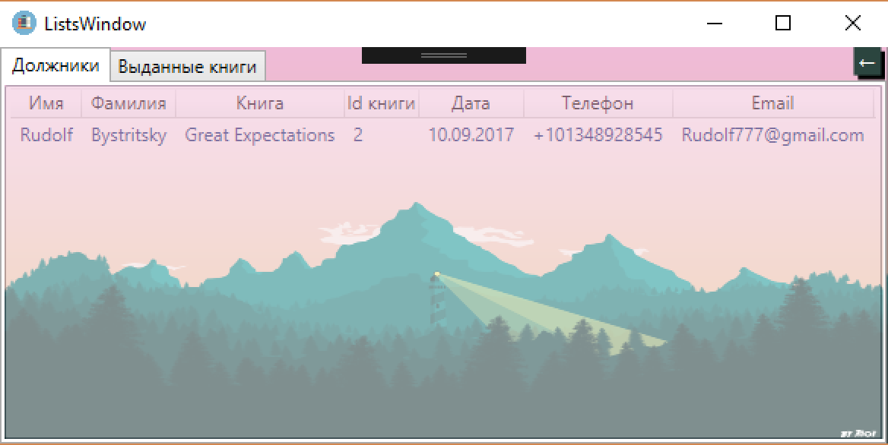
//окно со списком выданных книг и людей, которые взяли эти книги
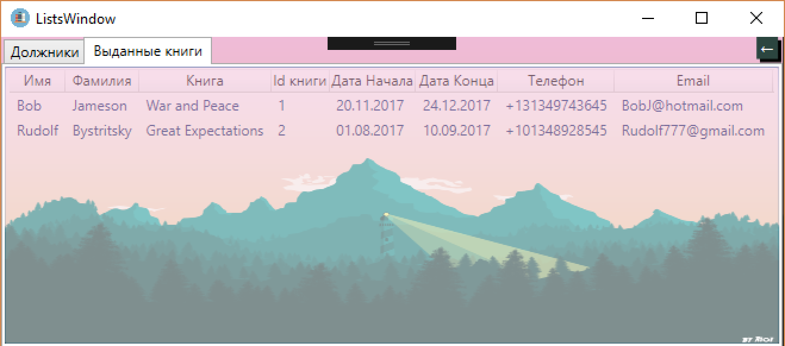

### Тесты:
-Вбивание в поля неподходящих данных (Например, слов в поле для даты)  
-Попытка выдать недоступную книгу  
-Попытка зайти под несуществующим админом  
-Попытка поставить книгу на несуществующую полку  
-Приём книги у несуществующего читателя  
-Приём книги у пользователя, который её не брал  
-Выдача книги незарегистрированному читателю  

При попытке совершить данные действия приложение выдаёт пользователю окно с предупреждением и объяснением ошибки. При этом программа не останавливается, и если закрыть окно с предупреждением, то можно продолжить работать в обычном режиме, т.е. подобные действия не нарушают работоспособность программы.

